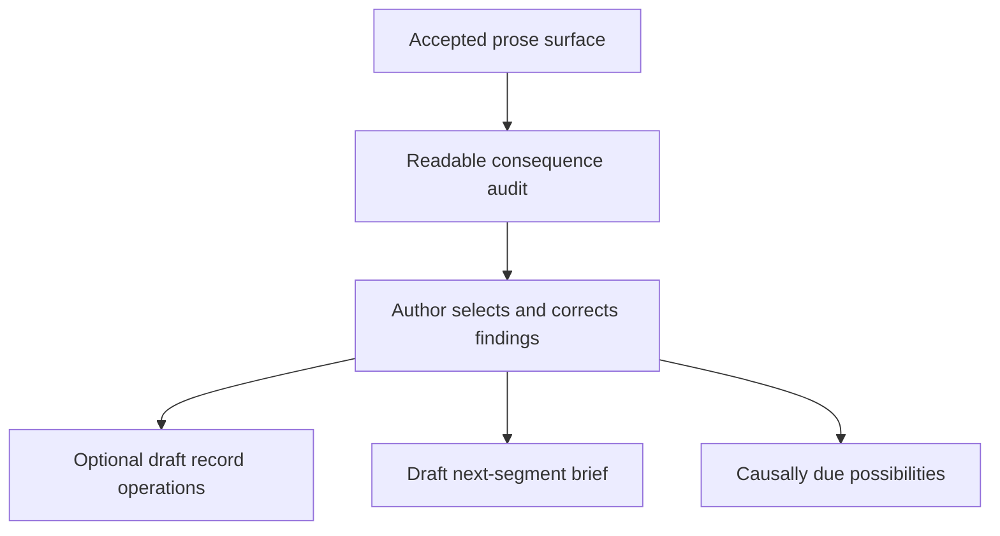

# Continuity Loom: Premise-Level Audit and Intended Changes

**Evidence base:** six LLM-led author-playtest reports dated 17–20 July 2026  
**Scope:** the causal-story premise, authority model, authoring workflows, and playtest method—not merely isolated UI defects  
**Status:** recommended product and method changes

## Executive decision

Changes are warranted, but the central premise is not disproven.

The playtests demonstrate a strong **continuity-aware scene renderer**. Given an extensively prepared record set and Generation Brief, Continuity Loom repeatedly produced prose that respected physical position, possession, visibility, knowledge boundaries, consent, character voice, current pressure, and precise stopping conditions. It also preserved unusually strong author custody: accepted prose remained noncanonical, records remained explicit, and no generated suggestion silently altered story truth.

The playtests do **not yet demonstrate the larger claim** that a compelling, potentially open-ended story can be sustained by causal accounting rather than dramatic-arc machinery. Most tested segments were tightly specified in advance, each project reached only one or two accepted segments, and every exercised post-acceptance reconciliation encountered at least one substantively empty result despite obvious state changes.

The highest-priority product problem is therefore not a missing dramatic structure. It is the costly and unreliable boundary between:

1. a newly accepted prose rendering;
2. the records that remain the only canon;
3. the temporary Generation Brief needed for the next segment; and
4. the causally due possibilities the author may wish to consider.

The recommended answer is to redesign **Segment Reconciliation** as a staged, readable **Consequence Review**:

- first identify consequences in clear natural language, without trying to author formal record mutations;
- let the author correct and select those findings;
- only then translate selected findings into optional structured draft operations;
- separately draft the next segment’s temporary handoff fields;
- surface possible downstream consequences without advancing anything automatically.

This preserves the researched records-only canon while removing much of the clerical scan-and-translation burden that currently falls on the author.

## Authority model to preserve

The following is not open for redesign. It is the product’s governing authority hierarchy, confirmed during the audit interview.

| Surface | Authority | Intended role |
| --- | --- | --- |
| Story records | **Sole canon** | Persistent story truth: entities, facts, events, clocks, emotions, beliefs, relationships, promises, objects, locations, and other record types. |
| `EVENT` record | Canonical, but optional | A compressed account of a scene-scale or otherwise historically meaningful past event, whether rendered, offstage, or author-declared. It is not required for every short prose segment. |
| Working Set | Selection, not canon | Controls which canonical records are materially relevant to a current operation. Exclusion does not make a record untrue. |
| Generation Brief | Temporary | Immediate context for the next segment: recent handoff, last image, current positions, visibility, local constraints, directive, and stopping guidance. |
| Accepted prose | Noncanonical surface | A readable rendering produced from records and temporary brief data. It is never a continuity database or source of truth by itself. |
| LLM assistance output | Noncanonical suggestion | May identify changes or possibilities, but never mutates story state without explicit author approval. |

Consequences of this hierarchy:

- Do not make accepted prose canonical.
- Do not introduce a second immutable event ledger beside records.
- Do not require an `EVENT` record for every few-beat segment.
- Do not allow clocks, entities, or processes to advance automatically.
- Do not turn accepted prose into long-term retrieval context in place of records.
- Do not create persistent “dismissed/deferred/watched” states merely to track whether the author used an LLM suggestion.
- Do make it much easier to decide what belongs in canonical records, what belongs only in the next brief, and what needs no retention.

## What the playtests genuinely establish

### 1. Local continuity control is strong

Across the reports, populated Generation Brief fields visibly influenced the generated prose:

- *The Unbidden Oath* preserved shrine geometry, door state, sword dormancy, object custody, injury, weather, knowledge locks, and exact stopping beats across two segments. All 22 opening fields and 23 continuation fields were reported as materially influential (UO1, lines 246–273; UO2, lines 181–209).
- *The Winter Letter* maintained one-room staging, object custody, revocable consent, staff pressure, Daniel’s offstage status, Clara’s epistemic limits, and exact reversible decisions across two segments (WL1, lines 243–272; WL2, lines 159–189).
- *Ash at Low Water* advanced time from 11:40 to 11:55, kept Nera as the only onstage person, made Iven exert pressure only through an existing order, and rendered the required safety procedure without inventing his live actions (ASH, lines 234–252).
- *The Signal at Long Barrow* kept Mara physically alone, preserved uncertainty about the signal’s sender and Elias’s status, and stopped before she chose whether to reply (SIGNAL, lines 202–219).

This is not cosmetic prompt obedience. It is real protection against teleportation, knowledge leakage, premature resolution, coercive shortcuts, and uncontrolled character drift.

### 2. Human authority and provenance are excellent

The product repeatedly made candidate state, acceptance, project custody, selected authority, and prompt identity inspectable. Accepted prose did not silently change records. Private Notes remained inert. The author could inspect, edit, and accept a candidate exactly once before any continuity work began (UO1, lines 78–89; UO2, lines 78–88; WL1, lines 97–106; WL2, lines 86–97; ASH, lines 101–110; SIGNAL, lines 111–121).

This boundary should be treated as a foundational strength, not as friction to eliminate.

### 3. Continuation persistence works

Both continuation projects reopened with their prior accepted segment, selected records, cast bands, brief state, and validation context intact. The author did not need to reconstruct the story from prose (UO2, lines 65–76 and 80–88; WL2, lines 75–84 and 86–97).

### 4. Progressive context is directionally correct

*Ash at Low Water* showed that a pressure-only offstage person can remain a lightweight `ENTITY` until active embodiment is required. Iven influenced the scene without an up-front full dossier, and the later linked `CAST MEMBER` path remained available (ASH, lines 40–48 and 122–132). This is an important principle for an open-ended system: canonical detail can deepen when it becomes causally relevant.

### 5. Rich character dossiers can control prose effectively

The reports show that full active dossiers are compiled and materially exposed. They do not yet prove whether every required field repays its authoring cost over a long story, but they do support the user’s experience that strong dossiers can drive characteristic behavior when a directive is deliberately open.

The correct near-term change is therefore not to weaken the `CAST MEMBER` model. It is to improve assistance around creating and activating dossiers, especially by allowing unknown optional material to remain unknown.

## What the playtests do not establish

### 1. They do not yet validate causal emergence

The tested prose was usually given a detailed local outcome:

- Hina must orient, meet Calen, agree to help, and stop with her hand on the mounted sword; the continuation must draw the sword, reposition her, sustain one impact, enter a lull, and stop on Calen’s warning (UO1, lines 45–51; UO2, lines 45–51).
- Tomás must present bounded evidence and obtain a reversible postponement; the continuation must present three exact facts, have Clara audit them, and end at another reversible decision (WL1, lines 48–59; WL2, lines 48–54).
- Nera must verify, refuse, photograph, tag, lock out, preserve evidence, and stop before Iven arrives (ASH, lines 50–56).
- Mara must recognize the calibration sequence and stop before deciding whether to reply (SIGNAL, lines 46–56).

These are valuable directed-rendering tests. They answer: **Can the system realize a chosen local unit without violating state?** They do not answer: **Can the records, character dispositions, clocks, emotions, promises, and previous consequences help discover a causally licensed next unit when the author has not already chosen its beats?**

Continuity Loom needs both modes, because the author sometimes knows the segment precisely and sometimes supplies only general guidance such as “have the characters act characteristically.” The current evidence covers the first mode far better than the second.

### 2. They do not test the intended horizon

The six reports cover four story projects and six accepted segments. No project advances beyond segment 2. Two adjacent chamber scenes cannot establish reliability for novella-, novel-, or open-ended serial continuity.

Untested accumulation risks include:

- dormant facts becoming relevant many segments later;
- multiple locations and offstage actors;
- overlapping clocks and deadlines;
- time skips, travel, sleep, and recurring processes;
- emotional persistence and revision;
- story-promise aging and transformation;
- relationship and belief changes over many interactions;
- context growth and retrieval precision;
- record lifecycle decisions after dozens of scenes;
- whether causal possibilities stay useful without becoming repetitive plot advice.

### 3. Emotions and story promises are barely exercised as systems

The prose contains psychologically sensitive material, but the reports do not evaluate persistence-relevant `EMOTION` transitions as canonical changes. They also contain natural story promises—the three-fact test, the independent-test demand, Iven’s coming confrontation, the meaning of Elias’s signal—without auditing promise creation, reinforcement, transformation, fulfillment, or abandonment.

This is an evidence gap, not proof that the record types are inadequate.

### 4. Time is tested as scene pressure, not as an open-ended temporal system

The reports show effective local use of times, deadlines, staff rounds, weather, and progress clocks. They do not test scheduled consequences becoming due, simultaneous offstage processes, uncertain time ranges, threshold crossings while the viewpoint is elsewhere, or conflicts between chronology and progress clocks.

### 5. The current method cannot isolate the value of causal records

Most field-influence tables show correspondence: a value appeared in the prompt and a compatible detail appeared in the response. The reports themselves acknowledge that targeted counterfactuals were generally absent (WL1, lines 350–358; WL2, lines 269–278; ASH, lines 371–382; SIGNAL, lines 295–303).

Without ablations, forks, or baselines, the tests cannot tell whether the full record system caused the result, whether the detailed `must_render` instruction did most of the work, or which repeated fields are redundant.

## Premise-critical findings

### P0 — Segment Reconciliation is the load-bearing failure

Every report that exercised post-acceptance reconciliation encountered at least one empty or false-negative result:

| Run | Observed result |
| --- | --- |
| *The Unbidden Oath*, segment 1 | First response returned no changes; an unchanged retry found ten grounded deltas (UO1, lines 125–132). |
| *The Unbidden Oath*, segment 2 | First response returned no changes; an unchanged retry found 12 brief replacements and record changes across ten fields (UO2, lines 100–108). |
| *The Winter Letter*, segment 1 | One response was empty and provenance-invalid; a paired response found eleven cited deltas (WL1, lines 179–189 and 226–241). |
| *The Winter Letter*, segment 2 | A correctly fingerprinted, structurally valid response returned three empty proposal arrays despite obvious `FACT`, `CLOCK`, and handoff changes (WL2, lines 106–116). |
| *Ash at Low Water*, segment 1 | Two unchanged-prompt draws returned byte-identical, unexplained empty results despite fracture, refusal, lockout, and evidence changes (ASH, lines 146–156 and 217–232). |

This is not a measured population failure rate: executor identities were often unknown, the actual configured provider was not exercised, and samples are small. It is nonetheless a consistent product warning. The formal output can look valid while doing none of the accounting the workflow exists to perform.

Prompt shrinkage alone did not solve it. *The Unbidden Oath* reconciliation prompt fell from 42,743 estimated tokens to 13,212, yet the false no-op recurred (UO1, lines 116–123; UO2, lines 88–108).

The likely design mistake is asking the model to perform three cognitively different tasks at once:

1. understand what happened in prose;
2. decide which consequences deserve retention and at what horizon; and
3. express those consequences as exact formal schema mutations.

The third task makes the first two less legible and less reliable. The workflow should separate them.

### P0 — Canon reconciliation is too clerical

The vigilant playtester recovered safely, but only by manually scanning records and brief fields:

- after *The Unbidden Oath* segment 2, the author re-authored 12 brief values, ten record fields, and cleared six consumed generation fields (UO2, lines 65–76);
- *The Winter Letter* required manual updates to the current `FACT`, `CLOCK`, brief, and later Private Note after an empty reconciliation (WL2, lines 75–84 and 106–116);
- *Ash at Low Water* required manual brief reconciliation after both assistance draws returned nothing (ASH, lines 88–99 and 146–156).

The user independently identifies this scan—considering additions, updates, deactivations, removals, and every relevant brief field—as one of the app’s most tiresome tasks.

That burden is especially dangerous because it is maintenance work disguised as a creative judgment. A system built around careful accounting should make the accounting visible and reviewable without requiring the author to remember every schema location.

### P1 — Durable record work and temporary handoff work are mixed together

Post-acceptance changes currently span two different authority horizons:

- **canonical consequences**, which belong in records; and
- **next-segment immediacy**, such as the last image, exact positions, visible conditions, local pressure, and stopping boundary, which belongs only in the temporary Generation Brief.

These should be reviewed together because they originate in the same accepted rendering, but they should not be presented as the same kind of change. A single scene may warrant:

- an update to an existing `FACT`;
- an advanced `CLOCK`;
- a changed `EMOTION` or `BELIEF`;
- a new or transformed story promise;
- no `EVENT` because the prose contains only a few minor beats;
- and a temporary last-image/position handoff for the next segment.

The redesigned workflow must classify retention horizon before it discusses record fields.

### P1 — The product lacks a dedicated “causally due” assistance workflow

The intended authoring model is not autonomous simulation. The app should identify possibilities and let the author incorporate or ignore them.

The current Ideate surface does not fully serve that purpose. In *The Unbidden Oath* continuation, the author needed possibilities for a non-revealing change in outside pressure, but Ideate had no field capable of carrying that question. It returned generic suggestions, some of which violated planned locks, and the author supplied the solution directly (UO2, lines 110–118 and 211–216).

Generic brainstorming is not enough. The app needs assistance explicitly organized around consequences already made due by records.

### P1 — Open-ended scope requires more than “active set” or “whole set”

An active-only scan can miss dormant promises, offstage actors, related emotions, scheduled clocks, and records that have just become relevant. A whole-project prompt will become expensive and noisy in an open-ended serial.

The appropriate scope is:

1. active records;
2. causal dependency closure around them;
3. a lightweight whole-project relevance/staleness scan;
4. full retrieval only for records selected as plausible dependencies.

This scope must be visible to the author. The system should explain why it included a non-active record and allow the author to remove it from the operation without changing canon.

### P1 — Canonical retention and prompt salience need clearer author guidance

The reports sometimes avoid recording potentially continuity-relevant details because they should not be repeated in the next segment. For example, *The Winter Letter* leaves the exact childhood cache and later the three exact facts out of separate atomic records because their immediate function is complete (WL1, lines 284–290 and 311–321; WL2, lines 201–209).

Under the confirmed record philosophy, the correct decision is contextual:

- include the details inside an `EVENT` when the entire evidentiary exchange is historically meaningful as a scene-scale event;
- create separate `FACT` records only when the details need independent retrieval or later causal use;
- update current beliefs, commitments, emotions, promises, and clocks with the consequences of the exchange;
- keep transient staging and last-image detail in the next Generation Brief only;
- store nothing when a detail has no continuity value.

The product should teach and assist this decision instead of implicitly equating “not active next segment” with “not worth canonical retention.”

### P1 — Suggestion generation must remain non-autonomous

Possible reactions from entities, threshold consequences from clocks, emotional aftereffects, or promise opportunities may be excellent suggestions. They must never advance world state merely because they were generated.

No persistent acceptance-status system is required. If a suggestion remains causally salient because the underlying records have not changed, recurrence is informative. If the records change, the suggestion should naturally disappear or change.

### P2 — Context integrity defects can undermine causal attribution

Two reports reveal prompt identity problems:

- a selected/material `ENTITY` short description did not compile despite help claiming it was prompt-facing (ASH, lines 134–144 and 254–265);
- Elias’s literal name disappeared from both compressed offstage and full active forms when `identity.one_line` did not repeat it (SIGNAL, lines 159–171).

Always compile a stable record identity separately from descriptive text. Field-level prompt provenance should make it clear which canonical value supplied each section.

### P2 — Assistance should preserve unknowns instead of inventing optional dossier truth

The Signal Cast-drafting assistance filled every property even when source material was silent. Mara required 45 corrections and Elias 59; Elias’s offstage form initially used only a tiny portion of that material (SIGNAL, lines 145–157).

Do not weaken the full dossier schema. Change the assistance contract so that:

- required core fields are completed;
- unknown optional fields may remain explicitly unknown or blank;
- speculative enrichments are presented separately from proposed canonical values;
- imported optional lists can be returned to a lawful zero-item state.

## Intended product changes

## Change 1 — Replace formal-first Segment Reconciliation with staged Consequence Review

### Goal

Let the author understand and approve what changed without asking the LLM to solve formal record mutation at the same moment it is trying to comprehend the prose.

### Proposed workflow

No arrow represents automatic canon mutation. Record operations become canonical only after explicit author approval and save.

### Stage A — Snapshot the comparison boundary

At generation or candidate staging, retain enough noncanonical metadata to reconstruct the comparison:

- prompt fingerprint and versions;
- IDs and versions of records included in the operation;
- relevant prior record values;
- prior Generation Brief values;
- accepted segment identity;
- selected reconciliation scope.

This is workflow metadata, not a new story-canon layer.

### Stage B — Produce a natural-language consequence audit

The first LLM pass should not emit JSON patches or exact schema mutations. It should answer, in readable language:

1. What actions or developments occurred?
2. What became true, ceased to be true, or changed degree?
3. What did each relevant entity learn, infer, believe, decide, promise, or stop intending?
4. What emotions or relationship stances changed in a persistence-relevant way?
5. Which clocks, deadlines, processes, resources, objects, positions, injuries, or statuses changed?
6. Which story promises were opened, reinforced, transformed, fulfilled, contradicted, or made newly actionable?
7. Which existing records may need update, deactivation, removal, or replacement?
8. Which new records may be warranted?
9. Which details matter only for the immediate next-segment handoff?
10. What downstream possibilities may now be causally due?
11. Which categories were checked and found unchanged, and why?

Each proposed consequence should contain:

- a concise description;
- causal basis in the accepted segment and/or prior records;
- affected entities or records when identifiable;
- confidence or uncertainty;
- suggested retention horizon: `canonical record`, `next brief only`, or `no storage needed`;
- any rival interpretation the author should resolve.

An all-clear result must explain its reasoning category by category. Silent emptiness is invalid.

### Stage C — Author correction and selection

The author may edit, split, combine, reject, or select findings. This selection is not itself canon. It is the approved interpretation supplied to the next stage.

The interface should support fast decisions without forcing persistent suggestion states:

- include for record planning;
- include for next-brief drafting;
- leave unused.

There is no need to remember that an unused item was “dismissed.”

### Stage D — Optional structured draft operations

Only selected canonical findings enter a second mapping pass. This pass may propose:

- create record;
- update record;
- deactivate record;
- remove record;
- keep distinct;
- no canonical operation required.

For every proposed operation, show:

- affected record and human-readable name;
- current value or status;
- proposed value or status;
- why the operation follows from the approved consequence;
- whether a new `EVENT`, `FACT`, `EMOTION`, `BELIEF`, `CLOCK`, `RELATIONSHIP`, promise, or other record type is appropriate;
- alternatives when more than one canonical representation is defensible.

The author may open a prefilled editor, accept an individual draft, or review a batch. No operation applies until the author approves it.

### Stage E — Draft the next Generation Brief separately

After canonical record work, the app should offer a draft of temporary next-segment fields:

- immediate situation;
- last visible moment;
- begin-after boundary;
- current positions and possession relevant to the next unit;
- visible and environmental conditions;
- what the viewpoint cannot currently perceive;
- local time pressure;
- newly consumed or cleared directives;
- a suggested stopping horizon, if requested.

This draft may use the accepted prose as evidence because it is preparing a temporary surface, but the UI must keep it visibly separate from canonical operations.

Consumed generation instructions should be easy to clear as a group. The author should not need to hunt through six or more fields after every acceptance.

### Stage F — Surface possible consequences without treating them as facts

The same reviewed change set may feed a final optional panel: “What may now follow?” These are possibilities, not deltas and not canon.

The panel should clearly distinguish:

- direct consequences already made unavoidable;
- likely reactions based on character records;
- clock or process consequences approaching their trigger;
- second-order ripples;
- questions created by uncertainty;
- mere interesting possibilities with weaker causal support.

### Scope assembly

Do not send every record blindly. Build scope in layers:

1. the active Working Set;
2. records linked to involved entities, objects, locations, clocks, relationships, emotions, beliefs, promises, and current goals;
3. records referenced by the prior brief or accepted segment;
4. a project-wide index/retrieval scan for records whose triggers or subjects plausibly intersect the changes;
5. full bodies only for retrieved candidates.

Expose the assembled scope before execution, including why each non-active record was included.

### Reliability safeguards

- Require a reasoned no-change result.
- Run category coverage validation before showing completion.
- Flag suspicious no-ops when the accepted segment contains obvious movement, possession, time, clock, belief, emotion, promise, injury, relationship, or status language.
- Allow a second audit pass focused only on categories missed or marked uncertain.
- Preserve the author’s ability to do everything manually.
- Test actual in-app parsing and application, not only cold outputs outside the app.

## Change 2 — Add a pre-generation Causally Due Developments workflow

### Goal

Support stories where the author has not chosen the next beats, without turning Continuity Loom into an autonomous simulator or an arc generator.

### Recommended modes

- **Due now:** What developments are already made likely or unavoidable by current records?
- **Entity responses:** Given each materially involved entity’s knowledge, aims, pressures, emotions, relationships, and dossier, what might they characteristically attempt?
- **Clock consequences:** Which thresholds, deadlines, or scheduled processes are approaching, and what would crossing them make possible?
- **Offstage ripples:** What might affected offstage entities notice or do, given only information they can possess?
- **Second-order consequences:** What less immediate effects could follow from the latest canonical changes?
- **Promise opportunities:** Which story promises have a natural opportunity to be reinforced, transformed, fulfilled, or complicated?
- **Causal questions:** Which observed changes still lack an established or deliberately deferred cause?
- **Focused question:** What specific uncertainty does the author want help with?

### Suggestion contract

Every suggestion should state:

- the canonical records that support it;
- the causal chain in plain language;
- necessary assumptions;
- which entity knows what;
- whether it is due, likely, merely available, or speculative;
- which locks or promises it respects or risks;
- what record changes would be needed only if the author chooses it.

The author may copy, adapt, or ignore the suggestion. No persistent response status and no automatic state change are needed.

## Change 3 — Clarify record-retention guidance

Add contextual guidance to Consequence Review and record creation:

| Question | Preferred representation |
| --- | --- |
| Is this a historically meaningful scene-scale occurrence whose compressed history may matter later? | Consider an `EVENT`. |
| Is this a proposition that needs independent future retrieval or causal use? | Consider a `FACT`. |
| Is it current belief, emotion, relationship stance, commitment, promise, object state, clock state, or other typed truth? | Update or create the corresponding typed record. |
| Does it matter only to the next immediate segment’s opening continuity? | Put it in the Generation Brief. |
| Is it incidental texture with no expected continuity consequence? | Store nothing. |

Do not encourage authors to create an `EVENT` from every accepted segment. A few beats of movement or dialogue often warrant only typed current-state changes and a next-segment handoff.

For a scene such as Clara’s three-fact exchange, a defensible outcome is:

- one `EVENT` containing the meaningful specifics if the entire evidentiary exchange is likely to matter as history;
- updated canonical belief, commitment, emotion, promise, and clock records representing its consequences;
- separate `FACT` records only for facts that need independent future use;
- temporary object arrangement and last-image details in the next brief.

## Change 4 — Improve progressive character assistance without weakening dossiers

- Preserve `ENTITY`-first offstage participation.
- Add a direct “create linked Cast dossier” action from eligible entities.
- After dossier creation, offer—but do not automatically perform—Working Set inclusion and cast-band configuration.
- Let assistance leave optional fields unknown or blank.
- Separate speculative enrichments from proposed canonical dossier values.
- Fix imported optional lists so the author can remove the last item and return to a lawful empty state.
- Always render stable entity identity separately from `identity.one_line`.
- Repair the discrepancy between `ENTITY.short_description` help and compilation.
- Before changing the dossier’s required core, run longitudinal full-versus-progressive dossier tests and measure downstream editing/continuity value.

## Change 5 — Add acceptance-time unsupported-novelty review

Several otherwise strong candidates introduced small unsupported claims:

- an unearned translation assertion in *The Unbidden Oath* (UO1, lines 286–294);
- an invented repairman and a mother-specific inference in *The Winter Letter* continuation (WL2, lines 201–207);
- an overstatement that ordinary contact was impossible in *The Signal at Long Barrow* (SIGNAL, lines 234–240).

Before or during Consequence Review, highlight candidate assertions that look like:

- new named entities;
- new biographical or relationship claims;
- new ownership or custody;
- new abilities, injuries, knowledge, or causes;
- new objective facts derived only from narration;
- categorical claims stronger than the canonical records.

The author may classify each as harmless texture, deliberate new canonical material, an edit to make, or an unsupported claim to ignore. Do not police ordinary sensory texture or style.

## Playtesting redesign

The existing reports are excellent at exact issue reproduction. Preserve:

- source/document blindness where relevant;
- prompt fingerprints and version metadata;
- explicit candidate intervention levels;
- byte-identical retry evidence;
- independent claim challenges;
- candid coverage limitations;
- visible action and field counts;
- explicit distinctions between observed fact and inference.

Add a second, separately named **Causal-Premise Validation** lane. Do not force every UI regression run to answer premise-level questions.

An issue-focused run may intentionally stop before canonical reconciliation. *The Signal at Long Barrow*, for example, left its accepted segment’s durable interpretation as explicit next-run work (SIGNAL, lines 256–266). That is legitimate for its bounded Cast-assistance target, but such a run must not count as end-to-end evidence for the causal premise.

## Test family A — Directed rendering

Continue the existing method: detailed `must_render`, hard locks, and precise stop guidance. This remains the right regression test for author control, physical continuity, sensitive portrayals, and compiler behavior.

Report verdict: **directed local realization**, not causal emergence.

## Test family B — Open causal continuation

Provide:

- canonical records;
- current entity goals, knowledge, emotions, relationships, promises, and clocks;
- physical and epistemic constraints;
- broad author intent or thematic permission;
- a general horizon such as “one locally complete response unit.”

Do not prescribe the exact action sequence or desired outcome. A permissible `must_render` may say that characters act characteristically or that causally due pressure becomes legible.

Evaluate:

- whether the chosen development follows from canonical causes;
- whether entities act only on available knowledge;
- whether the result creates unsupported convenience;
- whether the result is meaningfully different from restating the current state;
- whether surprise remains retrospectively intelligible;
- whether the stopping point is locally coherent without having been supplied.

## Test family C — Consequence Review gold fixtures

Build controlled accepted-segment fixtures with a human-authored expected consequence ledger. Include:

- object transfer;
- spatial movement;
- clock advancement and threshold crossing;
- fact becoming false;
- new belief without new knowledge;
- emotion triggered but not necessarily persistent;
- relationship boundary change;
- promise opened, transformed, or fulfilled;
- record that should be deactivated or removed;
- purely temporary handoff detail;
- scene where no canonical change genuinely occurs.

Score both the readable audit and the structured mapping stage.

Minimum initial gates:

- zero unreasoned empty outputs;
- 100% recall for seeded high-impact changes such as death, injury, location, custody, clock threshold, commitment, and secret disclosure;
- at least 90% recall across all adjudicated durable deltas;
- at least 85% precision before author correction;
- correct retention-horizon classification for at least 90% of fixtures;
- zero canonical mutation without explicit approval.

Treat these as starting product gates, to be revised after enough data exists—not as claims about current performance.

## Test family D — Causal counterfactual forks

Clone the same canonical state and change one cause:

- remove the deadline;
- make an order unsigned;
- make a private signal pattern public;
- change who possesses an object;
- give one entity a secret while withholding it from another;
- alter one emotion or commitment;
- advance one clock across its threshold.

Hold the directive constant. Verify that dependent possibilities change appropriately while unrelated state remains stable.

This isolates causal sensitivity rather than mere field correspondence.

## Test family E — Longitudinal serial runs

Run at least 12–20 accepted segments initially, followed by longer stress runs. Include:

- multiple locations;
- dormant characters returning;
- offstage actions proposed from limited knowledge;
- time skips and travel;
- overlapping clocks;
- secrets, conflicting beliefs, and later revelation;
- object transfers through several holders;
- emotional persistence, decay, and reappraisal;
- promises with short, medium, and long horizons;
- intentionally quiet segments without escalation;
- author-declared offstage `EVENT` records;
- both precise and open `must_render` segments.

Track:

- high-severity continuity contradictions;
- missed canonical record changes;
- stale records carried forward;
- false or missed clock consequences;
- belief/knowledge leakage;
- emotional discontinuity;
- forgotten or mechanically forced promises;
- dormant-record retrieval success;
- prompt growth and scope size;
- author minutes spent on creative decisions versus clerical reconciliation;
- manual fields touched per accepted segment;
- repeated consequence suggestions and whether unchanged canon justifies them.

## Test family F — Negative candidates

Deliberately supply candidates containing:

- an unrecorded object transfer;
- impossible spatial movement;
- unearned trust or emotional reversal;
- a secret known by the wrong person;
- an unexplained time jump;
- a crossed clock threshold with no consequence;
- a new named person;
- a fulfilled or abandoned promise with no canonical update;
- an offstage action requiring unavailable knowledge.

Measure whether candidate review and Consequence Review identify them, and whether the author can resolve them without automatically canonizing the prose.

## Test family G — Baseline comparison

For selected scenarios, blind-compare:

1. full canonical record context plus the same directive;
2. a conventional story-so-far summary plus the same directive;
3. canonical records with a sparse/open directive;
4. canonical records with the detailed directed brief.

Independent evaluators should separately judge:

- causal intelligibility;
- continuity;
- character agency and distinctiveness;
- emotional truth;
- unsupported invention;
- repetition;
- useful surprise;
- editing and reconciliation burden.

This determines what the record system contributes beyond a micro-outline or summary.

## Test family H — Real workflow coverage

The uploaded reports usually kept cold outputs outside the app and did not exercise the configured provider, provider parsing, result cards, or structured application paths. Add bounded runs through the actual in-app workflow with disclosed model and settings.

Use separate roles where possible:

- scenario/state author;
- prose generator;
- consequence auditor;
- continuity adjudicator;
- blind continuation author.

At least some sessions should involve human authors. LLM-led playtesting is well suited to exhaustive auditing but cannot establish ordinary human usability or literary value by itself.

## Required additions to the playtest report schema

Add the following sections when a run claims evidence about the causal premise:

### Causal-Premise Verdict

- Directed realization, open causal continuation, or both?
- What claim about the premise did this run actually test?
- What claim did it not test?

### Directive Density and Predetermination

- Which actions and outcomes were fixed in advance?
- Which were selected by the generator from canonical causes?
- Was the terminal beat supplied, discovered, or author-edited?

### Canonical Consequence Audit

| Candidate consequence | Causal evidence | Retention horizon | Suggested record operation | Human adjudication |
| --- | --- | --- | --- | --- |

This table is test evidence. It does not imply persistent suggestion tracking in the product.

### Next-Brief-Only Changes

List temporary positions, last image, visibility, and immediate pressure separately from canonical record changes.

### Causally Due Possibilities

Record which possibilities were suggested, their record basis, and whether an independent evaluator judged them due, plausible, weakly supported, or unsupported. Product state need not remember whether the author used them.

### State-Dimension Coverage

Explicitly mark exercised or unexercised:

- physical/spatial state;
- objects/resources;
- chronology and clocks;
- knowledge, secrets, and beliefs;
- emotions;
- relationships;
- commitments and intentions;
- story promises;
- offstage actors and processes;
- causal uncertainty/debt;
- record lifecycle;
- long-horizon retrieval.

### Reconciliation Performance

- expected durable deltas;
- expected brief-only changes;
- proposed deltas;
- correct, missed, and invented changes;
- false no-op status;
- author review time;
- structured-draft correction count;
- actual in-app application result.

### Longitudinal State

- accepted-segment depth;
- active and total record counts;
- retrieved non-active records;
- open clocks and promises;
- unresolved causal questions;
- prompt/token growth;
- contradiction and staleness ledger.

### Privacy-Safe Evidence Appendix

The current reports often retain hashes but no prompt, prose, or raw assistance output. Preserve privacy while retaining enough adjudicable structure:

- paraphrased event list;
- redacted before/after record values;
- complete categorized delta table;
- result-class counts;
- model/settings metadata where available;
- reasons for adoption or rejection.

## Phased implementation plan

### Phase 0 — Establish the benchmark before redesign

1. Turn the existing Unbidden, Winter, and Ash segments into gold consequence fixtures.
2. Separate durable record changes from next-brief-only changes.
3. Establish current reconciliation recall, precision, false-no-op rate, review time, and correction burden.
4. Retain the current formal workflow as a baseline.

### Phase 1 — Natural-language Consequence Review

1. Implement the readable first pass.
2. Require category coverage and reasoned no-change output.
3. Add author correction and selection.
4. Add hybrid active/dependency/project retrieval.
5. Retest against the gold fixtures.

### Phase 2 — Structured draft operations and next-brief drafting

1. Map selected consequences to proposed record operations.
2. Provide before/after review and prefilled editors.
3. Keep explicit per-change or reviewed-batch approval.
4. Separately draft temporary Generation Brief changes.
5. Add one-action clearing of consumed generation fields.

### Phase 3 — Causally Due Developments

1. Add focused assistance modes.
2. Require record-grounded causal explanations and epistemic discipline.
3. Keep all outputs suggestion-only.
4. Evaluate recurrence naturally as records change; add no persistent ignored-suggestion machinery.

### Phase 4 — Premise-validation campaign

1. Run open causal continuations and counterfactual forks.
2. Run 12–20 segment serials.
3. Compare against summary and directed-brief baselines.
4. Exercise actual provider/result/application paths.
5. Revisit record scope, dossier burden, and retrieval only after longitudinal evidence exists.

### Phase 5 — Lower-level integrity and usability fixes

1. Stable record identity in compiled Cast sections.
2. `ENTITY.short_description` help/compiler agreement.
3. Optional imported list removal to zero.
4. Unknown-preserving Cast assistance.
5. Direct linked-dossier activation handoff.
6. Remaining navigation, prompt-search, and Private Note save-state defects where still reproducible.

## Explicit non-recommendations

The evidence does **not** currently justify:

- making prose canonical;
- storing accepted prose as the continuity database;
- introducing a second event ledger beside records;
- requiring an `EVENT` for every accepted segment;
- automatically advancing entities, clocks, or processes;
- automatically applying reconciliation changes;
- adding dramatic arcs, mandatory escalation, or scheduled payoffs;
- tracking every ignored suggestion as persistent product state;
- weakening the rich `CAST MEMBER` schema solely because first-time setup is expensive;
- loading the entire open-ended project into every assistance prompt;
- treating a structurally valid empty LLM response as evidence that nothing changed.

## Final assessment

Continuity Loom’s underlying bet remains credible. The playtests show that records plus a precise temporary brief can produce unusually controlled prose without surrendering author authority. That is a substantial foundation.

The present system is strongest at **rendering from state** and weakest at **returning rendered consequences to state**. Because records are the only canon, that second half is not ancillary maintenance; it is the mechanism that makes a causal story persist.

The right improvement is not autonomous simulation and not an additional canon layer. It is a much better human-authorized accounting loop:

> readable consequences first, author judgment second, formal record work third, temporary handoff fourth, and causally due possibilities last.

Once that loop is reliable, the revised playtest lane must deliberately remove detailed beat prescriptions and carry projects far beyond two segments. Only then can the app show that its stories are not merely well-constrained renderings, but narratives whose next possibilities genuinely arise from what has already become true.

## Evidence key

- **UO1:** `playtest-the-unbidden-oath-2026-07-17T104952Z.md`
- **UO2:** `playtest-the-unbidden-oath-2026-07-18T145754Z.md`
- **WL1:** `playtest-the-winter-letter-2026-07-19T022000Z.md`
- **WL2:** `playtest-the-winter-letter-2026-07-20T023325Z.md`
- **ASH:** `playtest-ash-at-low-water-2026-07-19T102650Z.md`
- **SIGNAL:** `playtest-the-signal-at-long-barrow-2026-07-20T042703Z.md`
